<h1 align="center">
    Tracking de Comédiens
    <br>
</h1>

<h4 align="center">Solution de suivi des comédiens en temps réel, intégrant des filtres pour exclure les données aberrantes et un lissage par EMA.</h4>

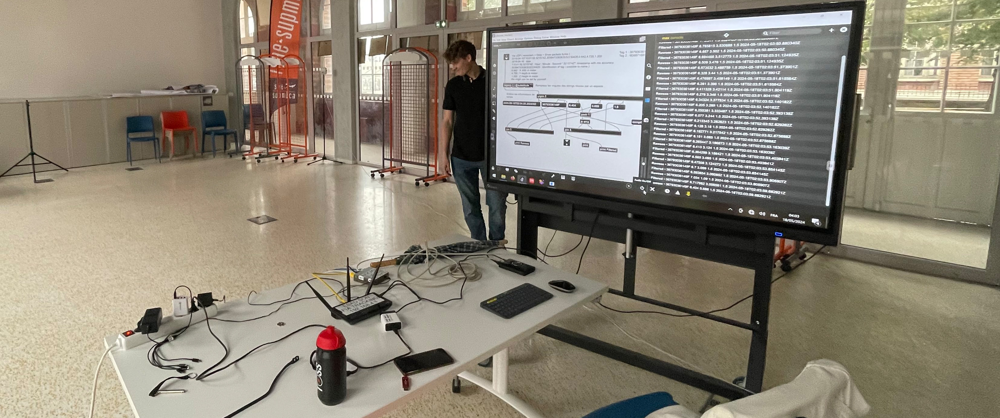

## Sommaire

- [Introduction](#installation)
    - [Contexte](#contexte)
    - [Problématique](#problématique)
    - [Objectifs](#objectifs)
- [Acquisition des données](#acquisition-des-données)
- [Traitement des données](#traitement-des-données)
    - [Transformation des données](#transformation-des-données)
    - [Animation des données brutes](#animation-des-données-brutes)
    - [Mise en place d'un filtre sur base d'un rayon d'exclusivité](#mise-en-place-dun-filtre-sur-base-dun-rayon-dexclusivité)
- [Mise en place de l'algorithme](#security)
    - [Problème du puits](#problème-du-puits)
    - [La prédiction pour régler le problème](#la-prédiction-pour-régler-le-problème)
    - [Le problème de l'excès de prédiction](#le-problème-de-lexcès-de-prédiction)
    - [La correction de la prediction](#la-correction-de-la-prediction)
    - [Lissage des données avec EMA](#lissage-des-données-avec-ema)
    - [Algorithme de filtrage final](#algorithme-de-filtrage-final)
- [Développement sur Max8](#développement-sur-maxmsp)
    - [Simulation de l'envoie de donnée](#simulation-de-lenvoie-de-donnée)
    - [Choix de la solution](#choix-de-la-solution)
    - [Implémentation dans Max8](#implémentation-dans-max8)
    - [Analyse des résultats](#analyse-des-résultats)
- [Ce qu'il faut retenir](#ce-quil-faut-retenir)
    - [Toutes les valeurs aberrantes ont été exclues](#toutes-les-valeurs-aberrantes-ont-été-exclues)
    - [L'algorithme EMA permet un lissage complet du parcours](#lalgorithme-ema-permet-un-lissage-complet-du-parcours)
    - [Nous constatons une lègere latence](#nous-constatons-une-lègere-latence)
    - [L'Histoire des Timestamps](#lhistoire-des-timestamps)
- [Remerciements](#links)

## Introduction

### Contexte

Le projet de suivi de comédiens en temps réel utilise le système Localino, une solution industrielle de localisation basée sur la triangulation. Ce système permet de déterminer la position d'un objet ou d'une personne en utilisant une balise et au moins trois ancres. Cependant, le système actuel souffre de problèmes significatifs de précision, notamment des sauts de position et des bruits.


L'un des principaux défis du projet réside dans la perte de qualité spatiale des données sonores. Le système WFS (Wave Field Synthesis), utilisé pour retranscrire les données spatiales du son, ne permet plus d'assurer la réelle spatialisation qui reflète le déplacement du comédien. En conséquence, la qualité de la spatialisation sonore est gravement affectée.

De plus, il n'existe actuellement aucune solution efficace pour filtrer complètement les données aberrantes générées par le système Localino.

### Problématique

Le suivi en temps réel des comédiens est compromis par les limitations techniques du Localino. Ce système présente en effet deux problèmes majeurs qui affectent la précision et la fiabilité.

* **Saut de position** : Le système Localino souffre de sauts de position imprévus, où la position détectée d'un comédien peut soudainement changer drastiquement sans raison apparente. 

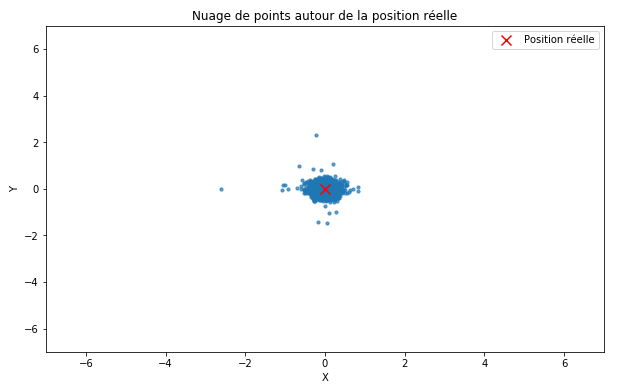

* **Bruit de mesure** : Le bruit constant généré par l'imprécision du matériel entraine des petites erreurs fréquentes.

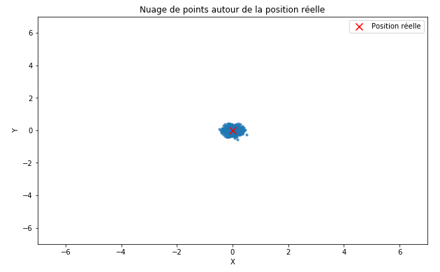

### Objectifs
Les **objectifs de ce projet** sont de :

1. Filtrer **les données aberrantes** pour éviter les sauts de position.
2. Mettre en place **un lissage des données** via l'EMA (Exponential Moving Average) pour limiter le bruit constant.
3. Développer un algorithme capable de **traiter les pertes de signal** et de **prédire la trajectoire**.

## Acquisition des données

Les mesures pour le suivi en temps réel des comédiens ont été réalisées dans la salle aquarium à ISAE-Supméca. Cette salle a été choisie en raison de sa taille suffisante pour simuler une scène de théâtre.

Pour la collecte des données, quatre ancres Localino ont été installées aux coins de la salle afin de couvrir l'ensemble de l'espace de manière optimale. Un seul tag Localino a été utilisé pour suivre la position d'un comédien. Ce tag, porté par le comédien, envoie des signaux aux ancres, permettant ainsi de calculer sa position en temps réel grâce au principe de triangulation.

Les données collectées comprennent des informations sur la position du comédien à différents moments, capturées sous divers scénarios et conditions (vitesse de déplacement variable, etc.). Ces mesures initiales sont fondamentales pour analyser la performance du système Localino et identifier les sources d'erreurs et de bruit dans les données de position.

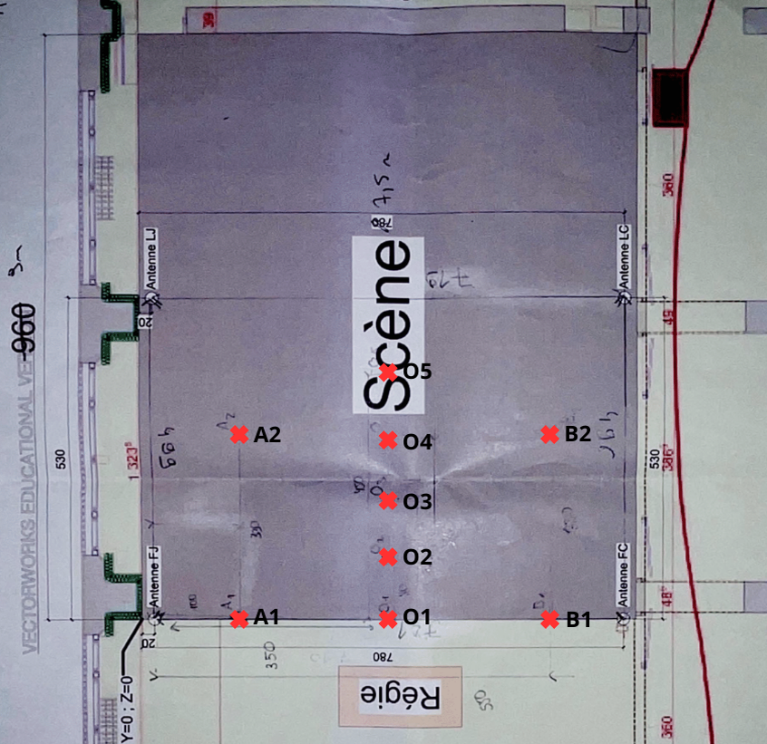

Pour cela, nous avons récolté une vingtaine de scénarios différents en dynamique et en statique grâce aux repères visuels (AX, OX et BX). Les données ont été collectées à une fréquence de 5 Hz, soit une mesure toutes les 200 ms.

## Traitement des données

### Transformation des données

Une fois les données brutes collectées par le système Localino, nous les avons transformer en formats exploitables pour l'analyse et le développement de filtres.

Les données brutes capturées par le tag, comprenant les coordonnées de position X,Y et Z ainsi que les timestamps correspondants, ont été exportées depuis Max8 en TXT, converties d'abord en fichier CSV, puis en panda dataframe pour faciliter la manipulation des données.

### Animation des données brutes

Pour mieux comprendre les comportements des données brutes et identifier les sources d'erreurs, des animations ont été réalisées. Ces animations, crées à partir des fichiers CSV, ont permis de visualiser les trajectoires du comédien en temps réel. Nous avons pu ainsi repérer les sauts de position, les bruits constants et les autres anomalies.

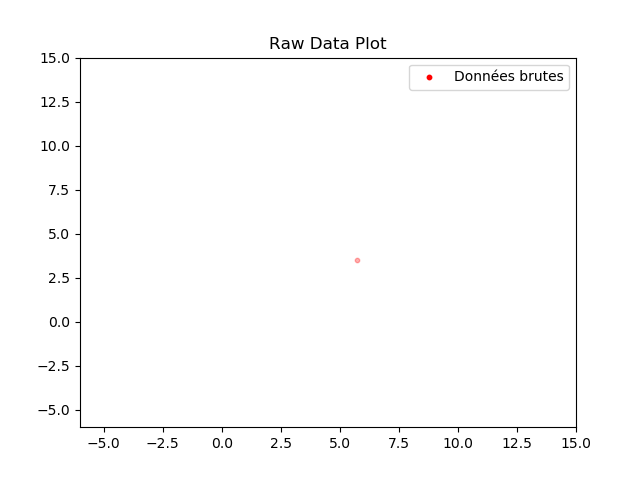

### Mise en place d'un filtre sur base d'un rayon d'exclusivité

Le principe du filtre de rayon d'exclusivité repose sur la détermination d'une distance maximale que le comédien peut parcourir entre deux périodes de rafraîchissement des données. Toute position mesurée se situant en dehors de cette distance est considérée comme aberrante et est écartée.

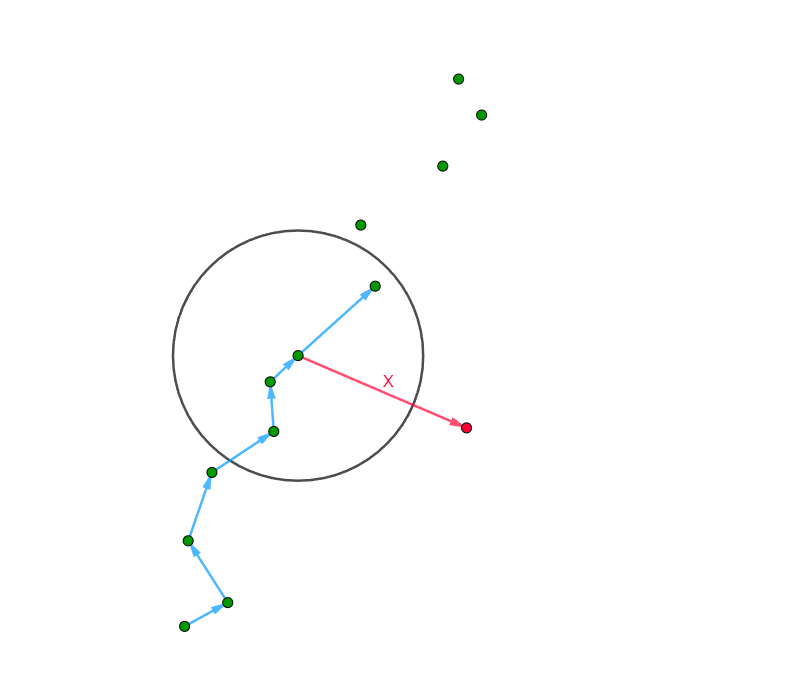

Nous avons considéré qu'une vitesse de 10km/h=2.78m/s était la vitesse maximale en moyenne pour un comédien. En prenant en compte la fréquence de rafraîchissement des données (5Hz), nous avons déterminé un rayon d'exclusivité de 0.556 mètres.


## Mise en place de l'algorithme

### Problème du puits

Sauf qu'un nouveau problème survient, celui que l'on nommera du "puits".

Lorsqu'une série de valeurs aberrantes est rejetée par le filtre, ces rejets successifs peuvent entraîner une situation où les nouvelles positions, bien que valides, se situent également en dehors du rayon d'exclusivité par rapport à la dernière position acceptée.

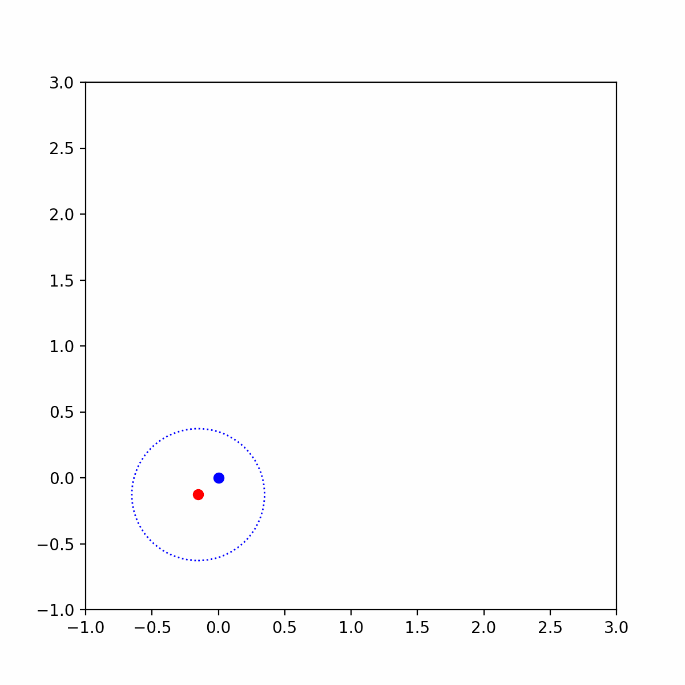

**Application du filtre "rayon d'exclusivité" avec un rayon de 1.5 m.**

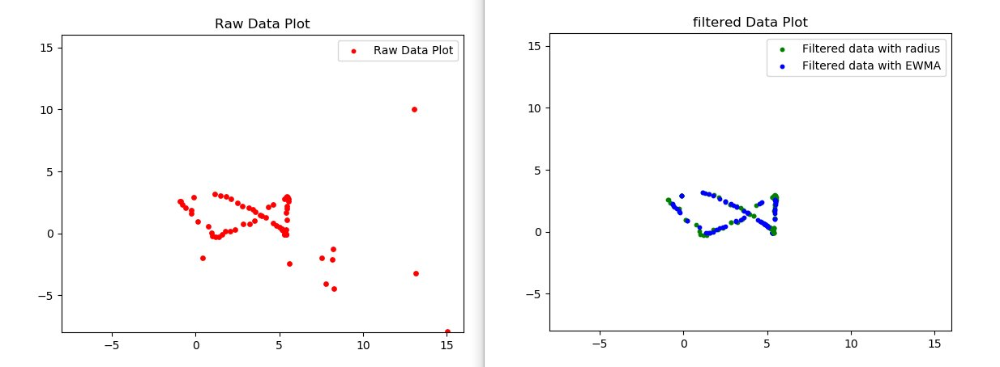

**Réduction du rayon à 1m, on observe l’apparition d’un puit ce qui empêche la progression de l’algorithme.**

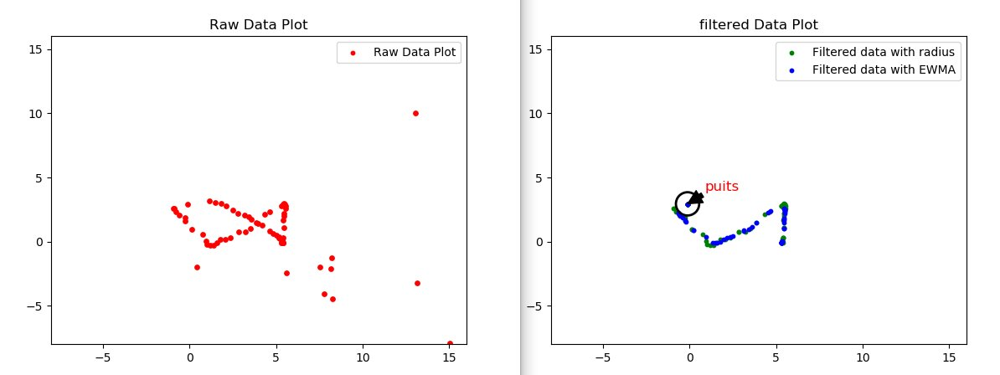

### La prédiction pour régler le problème

Pour surmonter ce problème, nous avons pensé à une méthode de prédiction assez simple. L'idée centrale est de calculer des positions futures basées sur la trajectoire précédemment observées du comédien. 

Ainsi lorsque le filtre de rayon d'exclusivité rejette une valeur aberrante, l'algorithme génère une position prédictive pour éviter la stagnation de la position.

Si $P_t$ est la position à l'instant t et $P_{t-1}$ est la position à l'instant précédent, alors la position prédictive $P_{t+1}$ vaut :

$$P_{t+1} = P_t + \alpha (P_t-P_{t-1})$$

### Le problème de l'excès de prédiction et la correction

Lorsqu'une position est exclue et que dans le même temps le comédien décide de changer de trajectoire, on se retrouve dans une situation où le filtre prédit une autre trajectoire, différente de celle réellement employée par le comédien. 

En effet, le filtre se base sur les données enregistrées avant la perte de données, il n'est donc pas étonnant que sa prédiction n'est plus juste. 

Afin de palier ce problème, on considère que les données, même si elles sont brutes, sont plus juste que les données prédites par le filtre.

Littéralement, cela se traduit par un nombre limite de prédiction qu'il est possible de faire avant de retourner de force sur les données brutes.


Finalement, cette limite permet au filtre de se corriger lorsque la prédiction prend trop la main, empêchant ainsi au système de prédire des positions trop aberrantes.

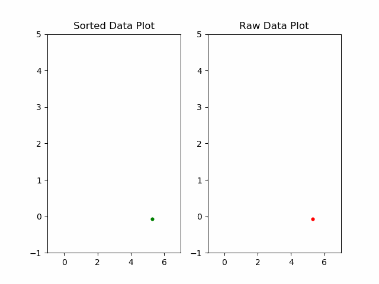

### Lissage des données avec EMA

Maintenant, attaquons-nous au problème du bruit constant.

L'EMA est une méthode de lissage qui applique un poids exponentiellement décroissant aux valeurs passées. Contrairement à une moyenne simple, l'EMA réagit plus rapidement aux changements récents tout en amortissant les variations brusques.

Soit une série de valeurs $P$, $\alpha\in[0;1]$ un coefficient de lissage, et $P_t$ la position actuelle, $Ema_t$ la position lissée alors :

$$ Ema_t = \alpha P_t + (1-\alpha) Ema_{t-1}$$

Un coefficient $\alpha$ élevé (proche de 1) donne plus de poids aux valeurs récentes, permettant à l'EMA de suivre plus étroitement les nouvelles données. Cela est utile pour des mouvements rapides où les changements de position sont fréquents.

Un coefficient $\alpha$ bas (proche de 0) lisse davantage les données, en mettant plus l'accent sur les valeurs passées. Cela est idéal pour atténuer les bruits et les fluctuations mineures.

Dans les différents tests que nous avons réalisé, il est acceptable de diminuer jusqu'à $\alpha$=0.33.


### Algorithme de filtrage final
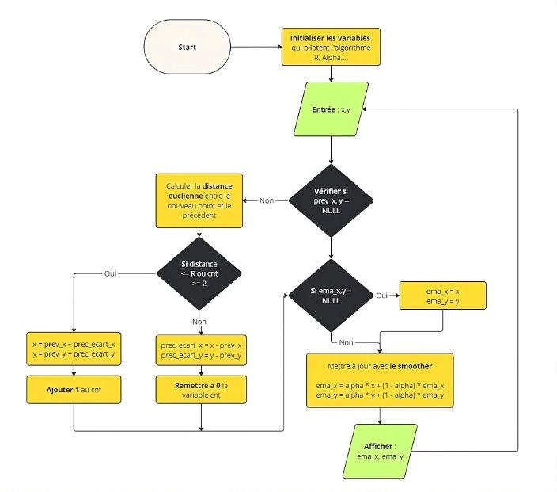


## Développement sur MaxMSP

### Simulation de l'envoie de donnée

Pour tester et valider l'algorithme de suivi en temps réel des comédiens, une simulation de l'envoi de données a été mise en place. Cette simulation permet de reproduire les conditions réelles de collecte de données sans nécessiter une mise en scène physique constante. Ce qui nous a permis donc de travailler chacun à distance.

Les données de position du comédien ont été préenregistrées dans des fichiers CSV lors de sessions de test.
Un script en JavaScript a été développé pour simuler l'envoi des données à partir des fichiers CSV.

Le script lit les données du fichier CSV et les envoie à intervalles réguliers (par exemple, toutes les 200 millisecondes) pour imiter la fréquence de rafraîchissement du système Localino.

Un objet Max (bang) a été utilisé pour déclencher l'importation du fichier CSV et démarrer la simulation.

Les données simulées sont ensuite visualisées en temps réel dans la console de Max8 pour observer le comportement de l'algorithme.

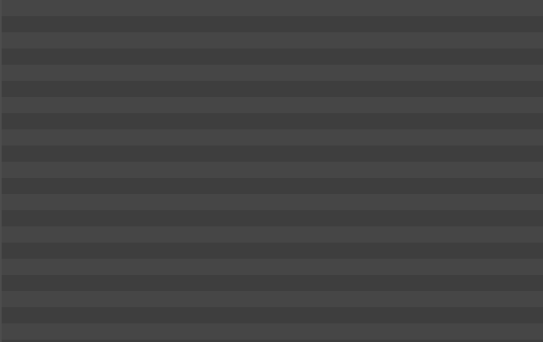


### Choix de la solution

Voici le tableau comparatif des différentes solutions envisagées.

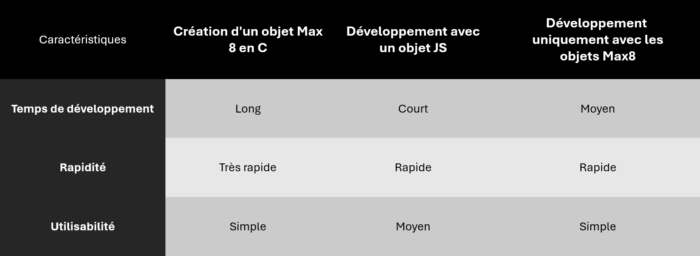
Finalement, nous avons choisi la solution 2, celle avec un objet JS.

### Implémentation dans Max8

Un script JavaScript a été développé pour gérer les aspects principaux de l'algorithme, incluant le filtrage () et le lissage des données. 

Ce script a été intégré dans un patch Max8 à l'aide de l'objet js. Cet objet permet d'exécuter le code JavaScript directement dans l'environnement Max8.

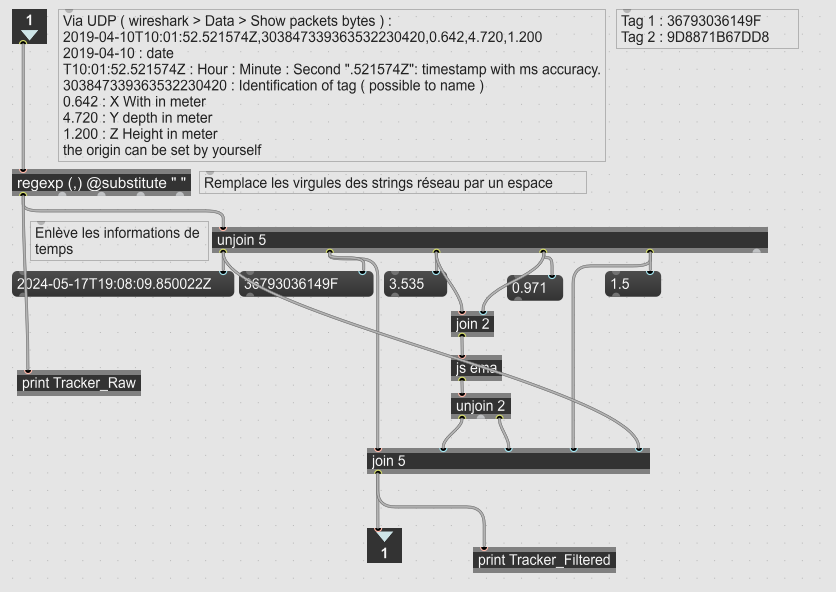

De plus, celui-ci a été conçu pour que les variables d'intérêt soient facilement modifiables comme $\alpha$, cnt, $R_{max}$ etc..

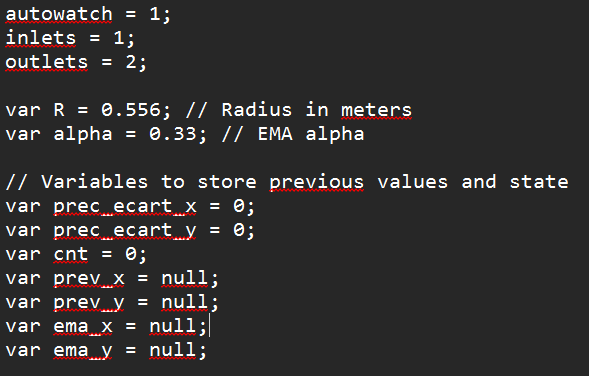

### Analyse des résultats

Pour évaluer la performance de l'algorithme final, nous sommes remis dans des conditions réelles de collecte de données. Puis, de la même manière que la dernière fois, nous avons réalisé différents scénarios puis enregistrer en temps réels, les données brutes et filtrées pour pouvoir les comparer par la suite.

Nous avons créer un nouveau notebook.

## Ce qu'il faut retenir

Dorénavant, toutes les animations qui vont suivre sont issues des tests effectués dans des conditions réelles.

Tous les rendus des animations sont regroupés <a href="\data\gif\18-05-2024\">ici</a>

### Toutes les valeurs aberrantes ont été exclues

L'algorithme de filtrage basé sur le rayon d'exclusivité a démontré une grande efficacité dans l'élimination des valeurs aberrantes. Les positions situées en dehors du rayon défini par rapport à la dernière position valide ont été rejetées, réduisant donc les sauts brusques.

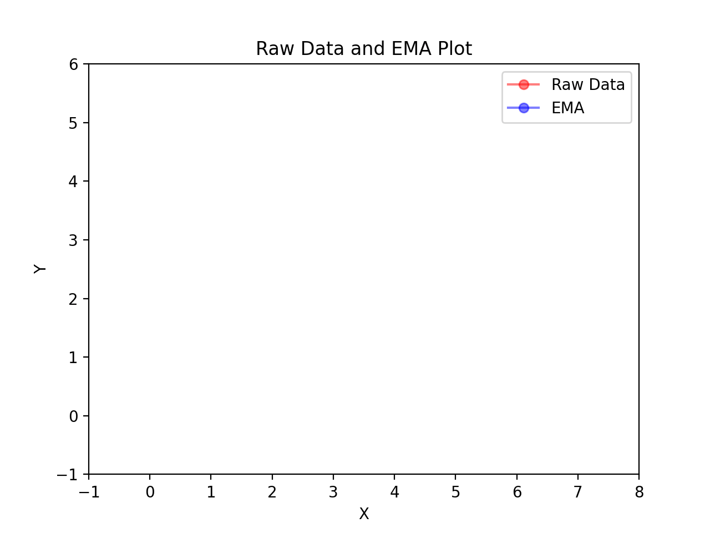


### L'algorithme EMA permet un lissage complet du parcours

L'utilisation de l'algorithme EMA a amélioré la fluidité des trajectoires. En appliquant un coefficient de lissage adapté (0.33), l'EMA a atténué les fluctuations mineures, qui fournit maintenant des trajectoires plus stables et réalistes. Il faut donc éviter d'activer le smoother d'origine pour éviter de rajouter de la latence inutilement.


### Notre algorithme ne prédit pas lorsque l'on perd la connexion

Une caractéristique importante de l'algorithme est qu'il ne prédit pas lorsqu'il y a une coupure.

Cela est dû au fait que Localino ne renvoie pas de valeurs aberrantes lorsqu'il perd la connexion. Dans ce cas, l'algorithme ne s'executera pas.

Seulement lorsque la connexion est rétablie, l'algorithme reprendra là où il s'était arrêté et à l'aide du lissage EMA, il réalisera une "rétro-prédiction" pour éviter un gros saut.

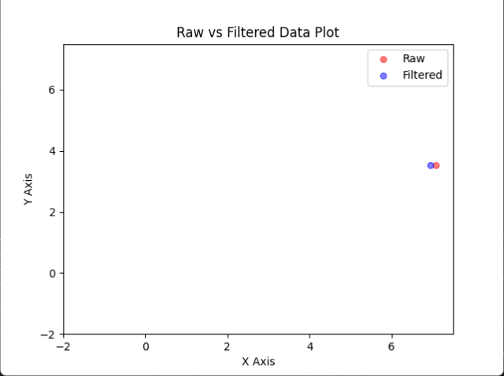

### Nous constatons une lègere latence 

Une légère latence de 400ms (sans coupures) a été observée dans le suivi des positions en temps réel, ce qui correspond à 2 fois le rayon maximal fixé. Cette latence est principalement due au coefficient $\alpha$ associé au smoother. Toutefois, cette latence est restée dans des limites acceptables pour les applications prévues.

### L'Histoire des Timestamps

Lors des tests, il a été observé que les timestamps des positions capturées étaient décalés, ce qui signifie que les positions enregistrées n'étaient pas alignées avec les moments réels des mouvements des comédiens. Nous avons donc du réaligner les timestamps pour obtenir les trajectoires en temps réels.

## Remerciements

Nous tenons à remercier Monsieur STRICHER et Monsieur FONTANA de nous avoir accompagné tout au long de ce projet !

```
Quentin PETIT
Alexei YADRIN
Antonin CLERICE
```
